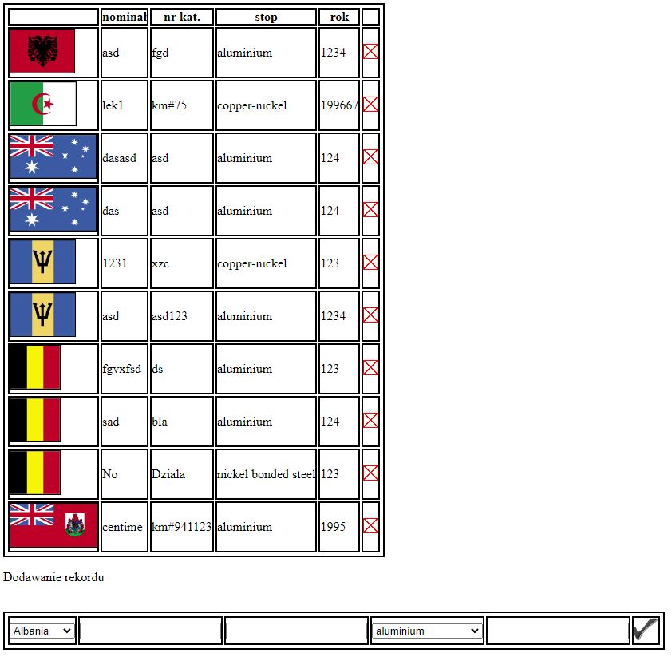
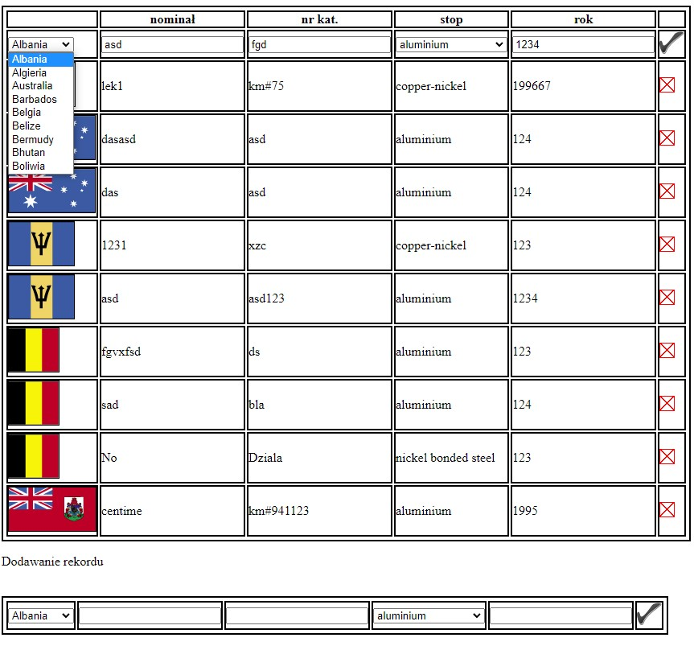

<h1>Coins</h1>

Link to hosted website: <a href="http://szariiii.ct8.pl/monetki/index.html">http://szariiii.ct8.pl/monetki/index.html</a>

Full stack app made using php and js. In app you can add your own currency for some countries.
You can change:
    <ul>
        <li>country</li>
        <li>denomination</li>
        <li>catalog number</li>
        <li>material</li>
        <li>year</li>
    </ul>

<h2>Screen shots:</h2>

